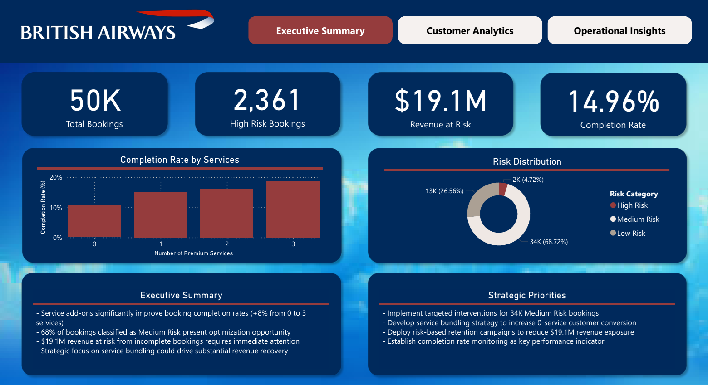
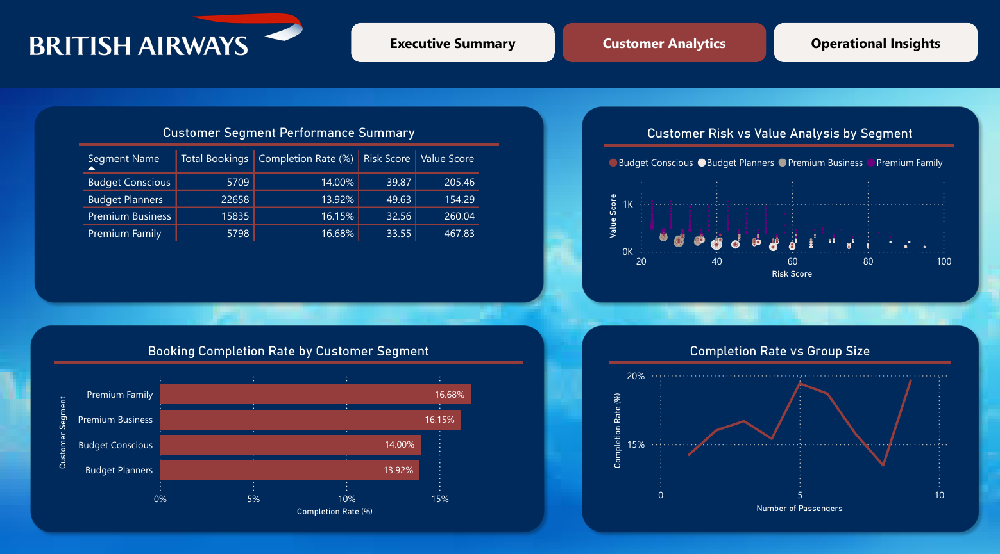
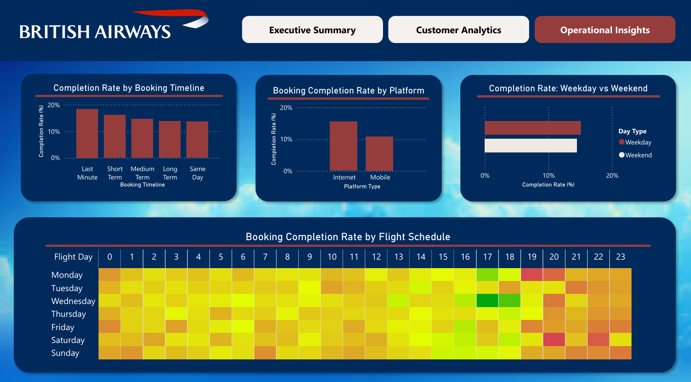

# British Airways Business Intelligence Dashboard

## Project Overview
This project analyzes British Airways booking data to provide actionable business intelligence insights through Python data analysis and Power BI visualization. The analysis focuses on customer behavior, booking patterns, and revenue optimization opportunities.

## Dashboard Preview

### Executive Summary

*Key performance indicators and strategic insights overview*

### Customer Analytics

*Customer segment performance and risk-value analysis*

### Operational Insights

*Booking patterns, platform performance, and flight schedule heatmap*

## Key Metrics
- **Total Bookings:** 50,000
- **High Risk Bookings:** 2,361 (4.72%)
- **Revenue at Risk:** $19.1M
- **Overall Completion Rate:** 14.96%

## Customer Segments Analysis

### 1. Premium Family (5,798 bookings)
- **Completion Rate:** 16.68% *(Highest)*
- **Value Score:** 467.83
- **Risk Score:** 33.55
- **Characteristics:** High-value customers with strong completion rates

### 2. Premium Business (15,835 bookings)
- **Completion Rate:** 16.15%
- **Value Score:** 260.04
- **Risk Score:** 32.56
- **Characteristics:** Largest premium segment with consistent performance

### 3. Budget Conscious (5,709 bookings)
- **Completion Rate:** 14.00%
- **Value Score:** 205.46
- **Risk Score:** 39.87
- **Characteristics:** Price-sensitive with moderate risk profile

### 4. Budget Planners (22,658 bookings)
- **Completion Rate:** 13.92% *(Lowest)*
- **Value Score:** 154.29
- **Risk Score:** 49.63
- **Characteristics:** Largest segment requiring targeted interventions

## Key Business Insights

### 1. Service Impact Analysis
- Premium services significantly improve booking completion rates (**+8% from 0 to 3 services**)
- 68% of bookings classified as Medium Risk present optimization opportunity
- Service bundling strategy could unlock substantial revenue potential

### 2. Platform Performance
- **Internet bookings** show higher completion rates than mobile platforms
- **Last-minute bookings** demonstrate the highest completion rate
- Platform optimization needed for mobile user experience

### 3. Operational Timing Patterns
- Clear weekday vs weekend completion rate variations identified
- Detailed flight schedule heatmap reveals optimal booking windows
- Strategic pricing opportunities during peak performance periods

### 4. Risk Distribution
- **High Risk:** 2K bookings (4.72%)
- **Medium Risk:** 34K bookings (68.72%) - *Primary intervention target*
- **Low Risk:** 13K bookings (26.56%)

## Business Impact & ROI Potential
- **Revenue Protection:** $19.1M at-risk revenue identified for immediate intervention
- **Conversion Opportunity:** 34K Medium Risk bookings targeted for retention campaigns
- **Service Optimization:** +8% completion rate improvement through strategic service bundling
- **Operational Efficiency:** Data-driven booking timeline and platform optimization

## Technical Skills Demonstrated
- **Data Analysis:** Python (pandas, numpy, scikit-learn)
- **Machine Learning:** K-means clustering, feature engineering, risk scoring algorithms
- **Data Visualization:** Power BI, matplotlib, seaborn
- **Business Intelligence:** KPI development, customer segmentation, performance metrics
- **Statistical Analysis:** Correlation analysis, completion rate modeling

## Technical Implementation

### 1. Data Processing (Python)
```python
# Key libraries and techniques used:
# - pandas, numpy: Data manipulation and analysis
# - matplotlib, seaborn: Statistical visualizations
# - scikit-learn: K-means clustering for customer segmentation
# - Custom risk scoring algorithms
# - Feature engineering for business metrics
```

### 2. Power BI Dashboard Development
- **Interactive Visualizations:** Three comprehensive dashboard pages
- **Custom Metrics:** Risk scoring, completion rates, value analysis
- **Advanced Charts:** Heatmaps, scatter plots, performance matrices
- **Business Intelligence:** Executive KPIs and operational insights

## Strategic Priorities & Recommendations

### Immediate Actions (0-3 months)
- Deploy targeted retention campaigns for 34K Medium Risk bookings
- Implement service bundling strategy to convert 0-service customers
- Launch mobile platform optimization initiative

### Medium-term Strategy (3-12 months)
- Establish completion rate monitoring as key performance indicator
- Develop dynamic pricing models based on booking timeline insights
- Create customer journey optimization for Budget Planners segment

### Long-term Vision (12+ months)
- Build predictive analytics for proactive risk management
- Implement real-time dashboard for operational decision-making
- Scale analytics framework across additional business units

## Project Structure
```
British_Airways_BI_Dashboard/
├── British_Airways_Business_Intelligence_Dashboard.ipynb
├── British_Airways_Business_Intelligence_Dashboard.pbix
├── data/
│   └── airline_bookings.csv
├── exports/
│   ├── airline_bookings_complete_analysis.csv
│   ├── business_metrics_summary.csv
│   ├── customer_segment_summary.csv
│   ├── data_dictionary.csv
│   └── sales_channel_summary.csv
├── images/
│   ├── executive_summary.png
│   ├── customer_analytics.png
│   └── operational_insights.png
├── README.md
└── requirements.txt
```

## How to Run This Project

### 1. Clone the repository
```bash
git clone [repository-url]
cd British_Airways_BI_Dashboard
```

### 2. Install dependencies
```bash
pip install -r requirements.txt
```

### 3. Run the analysis
- Open `British_Airways_Business_Intelligence_Dashboard.ipynb` in Jupyter Notebook
- Execute all cells to reproduce the analysis

### 4. View the dashboard
- Open `British_Airways_Business_Intelligence_Dashboard.pbix` in Power BI Desktop
- Interact with the visualizations and filters

## Data Sources & Methodology

- **Original Dataset:** Kaggle airline booking data (50,000 records)
- **Data Enhancement:** Feature engineering and business metric calculation
- **Analysis Scope:** 24 features covering customer demographics, booking behavior, and service utilization
- **Validation:** Cross-validation of clustering results and business logic verification

## Portfolio Highlights
This project demonstrates end-to-end business intelligence capabilities:

✅ **Data Engineering:** ETL processes and feature engineering
✅ **Advanced Analytics:** Machine learning clustering and risk modeling
✅ **Business Intelligence:** Interactive dashboards and KPI development
✅ **Strategic Thinking:** Actionable recommendations with ROI quantification
✅ **Technical Proficiency:** Python, Power BI, and statistical analysis

## Author
**Hansel Liebrata**  
Business Intelligence & Data Analytics Portfolio

## Date
August 2025

---

*This is a portfolio project demonstrating comprehensive business intelligence capabilities, from data preprocessing through advanced analytics to executive-level dashboard development and strategic recommendations.*
